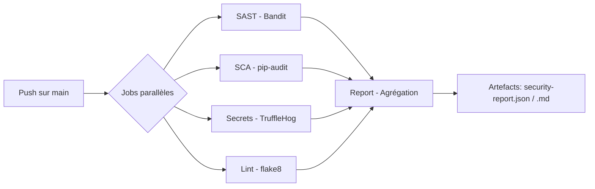
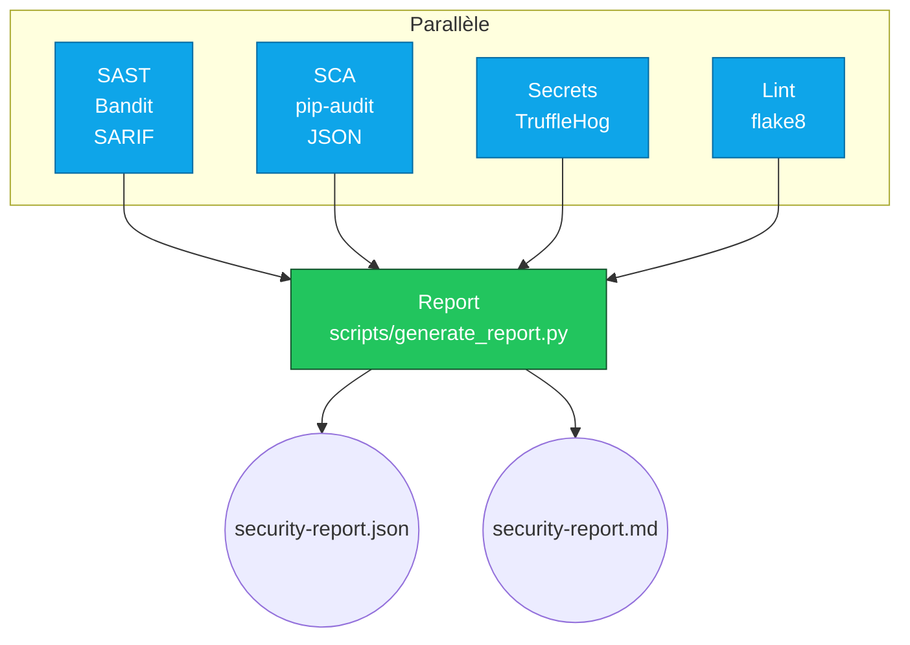
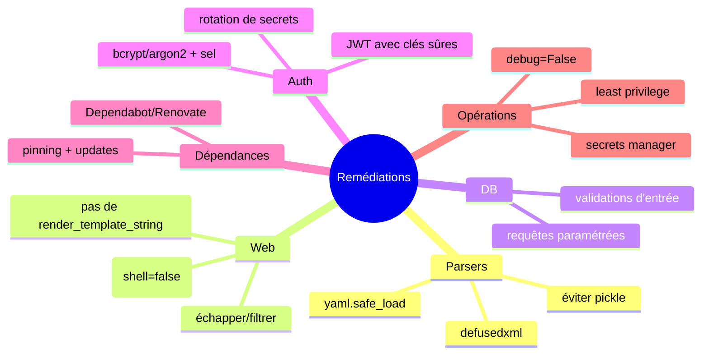

# DevSecOps Pipeline Secure

Pipeline CI/CD de sécurité automatisé — SAST, SCA, scan de secrets, lint — avec rapport consolidé à chaque push.


---

## Présentation

J'ai construit ce pipeline pour démontrer comment intégrer la sécurité
directement dans le cycle de développement, avant que le code parte en production.
L'idée centrale c'est le **shift-left security** : détecter les vulnérabilités
le plus tôt possible dans le cycle CI/CD plutôt que de les découvrir en production.

Le pipeline analyse automatiquement le code source à chaque push sur `main`
et bloque le déploiement si des vulnérabilités critiques sont détectées.
Pour démontrer son fonctionnement, j'ai développé une application Python
volontairement vulnérable couvrant l'OWASP Top 10.

---

## Vue d’ensemble

Ce repo contient:
* Un pipeline GitHub Actions avec 5 jobs (SAST, SCA, Secrets, Lint, Report)
* Une application Flask volontairement vulnérable (OWASP Top 10) pour la démo




---

## Structure

```
DevSecOps-pipeline-secure/
├── .github/workflows/security.yml     # Pipeline sécurité (SAST, SCA, Secrets, Lint, Report)
├── app/
│   ├── main.py                        # Flask (SSTI, RCE ping, open redirect)
│   ├── auth.py                        # JWT faible, MD5/SHA1, secrets encodés
│   ├── database.py                    # SQL injection (concat/f-strings)
│   ├── files.py                       # Path traversal, SSRF, write arbitraire
│   ├── parsers/
│   │   ├── pickle_parser.py           # Désérialisation pickle → RCE
│   │   ├── yaml_parser.py             # yaml.load() non sécurisé → RCE
│   │   └── xml_parser.py              # XXE / Billion Laughs
│   └── requirements.txt               # Versions vulnérables pour SCA
├── scripts/generate_report.py         # Agrège → security-report.json/.md
├── tests/test_main.py                 # Tests unitaires (wrappers)
└── README.md
```

---

## Détails du pipeline



Artefacts et sorties:
* reports/bandit-results.sarif
* reports/pip-audit-results.json
* security-report.json
* security-report.md

Captures recommandées:
* 
* 
* 

---

## L’application vulnérable (OWASP Top 10)

```mermaid
graph LR
    U[Client] -->|HTTP| F[Flask app (main.py)]
    F --> A[auth.py]
    F --> D[database.py]
    F --> FI[files.py]
    F --> P[parsers/]
    P --> P1[pickle_parser.py]
    P --> P2[yaml_parser.py]
    P --> P3[xml_parser.py]
    D -->|sqlite3| DB[(users.db)]
```

| Zone | Fichier | Vulnérabilités (exemples) | OWASP |
|---|---|---|---|
| Auth | auth.py | JWT secret faible, MD5/SHA1, credentials codés | A02, A07 |
| DB | database.py | SQLi via concat/f-strings, second-order | A03 |
| Fichiers/Réseau | files.py | Path traversal, SSRF, write arbitraire | A01, A10 |
| Web | main.py | SSTI, injection de commande, open redirect, debug=True | A03, A05 |
| Parsers | pickle/yaml/xml | RCE pickle, yaml.load non sûr, XXE/Billion Laughs | A08 |
| Dépendances | requirements.txt | Versions obsolètes/vulnérables | A06 |

Avertissement: ce code est intentionnellement vulnérable. Ne pas exposer publiquement.

---

## Prérequis

* Python 3.10–3.12
* pip + venv
* GitHub Actions actif
* SQLite (embarqué)

---

## Installation

* git clone https://github.com/<user>/DevSecOps-pipeline-secure.git
* cd DevSecOps-pipeline-secure
* python -m venv .venv
* source .venv/bin/activate    (Windows: .venv\Scripts\Activate.ps1)
* pip install -r app/requirements.txt

---

## Lancer en local

* python -m app.main   (ou: python app/main.py)
* Exemples:
    * curl "http://localhost:5000/hello?name=world"
    * curl "http://localhost:5000/ping?host=localhost"
    * curl -i "http://localhost:5000/redirect?url=/hello"

Note: endpoints vulnérables par conception. Usage local/contrôlé uniquement.

---

## Base de données (démo)

```
sqlite3 users.db "CREATE TABLE IF NOT EXISTS users (id INTEGER PRIMARY KEY, username TEXT, password TEXT, email TEXT);"
sqlite3 users.db "CREATE TABLE IF NOT EXISTS pending_updates (user_id INTEGER, email TEXT);"
sqlite3 users.db "INSERT INTO users (username, password, email) VALUES ('admin','admin1234','admin@example.com');"
```

---

## Tests

```
pytest -q
# ou avec couverture si installé:
pytest --cov=app --cov-report=term-missing
```

Vérifie:
* calculate("1 + 1") == 2
* check_admin("admin1234") == True
* hash_password("password") → MD5 hex 32 chars

---

## Extrait du rapport (exemple)

| Outil | Statut | Findings |
|---|---|---|
| Bandit (SAST) | FAILED | 5 HIGH, 18 MEDIUM, 5 LOW |
| pip-audit (SCA) | FAILED | 12 vulnérabilités |
| TruffleHog (Secrets) | PASSED | - |
| flake8 (Lint) | PASSED | - |

---

## Bonnes pratiques (pistes de remédiation)



---

## Détails du workflow GitHub Actions

Fichier: .github/workflows/security.yml

1) SAST — Bandit
* Scan récursif app/, export SARIF (onglet Security)
* “Security Gate” High bloquant

2) SCA — pip-audit
* Audit de app/requirements.txt (ou l’environnement)
* Échec si CVE détecté
* Artefact JSON

3) Secrets — TruffleHog
* Scan historique (only-verified)

4) Lint — flake8
* max-line-length=120 (informatif)

5) Report — Agrégation
* Télécharge artefacts
* Exécute scripts/generate_report.py
* Publie security-report.json / .md

---


